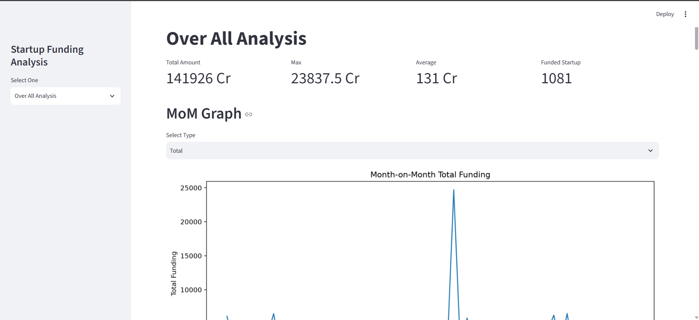
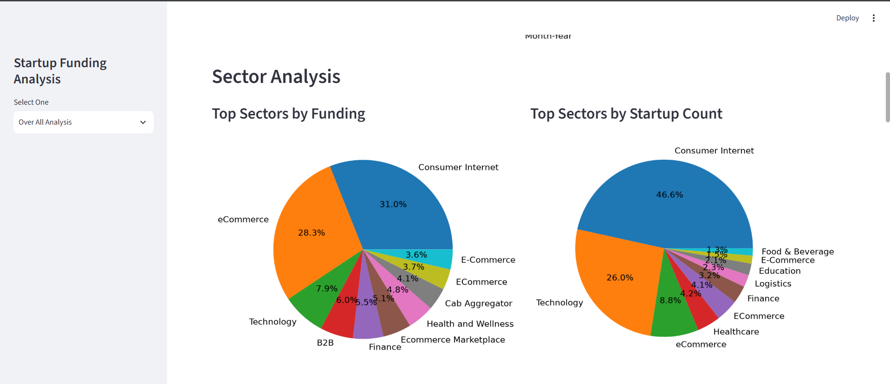
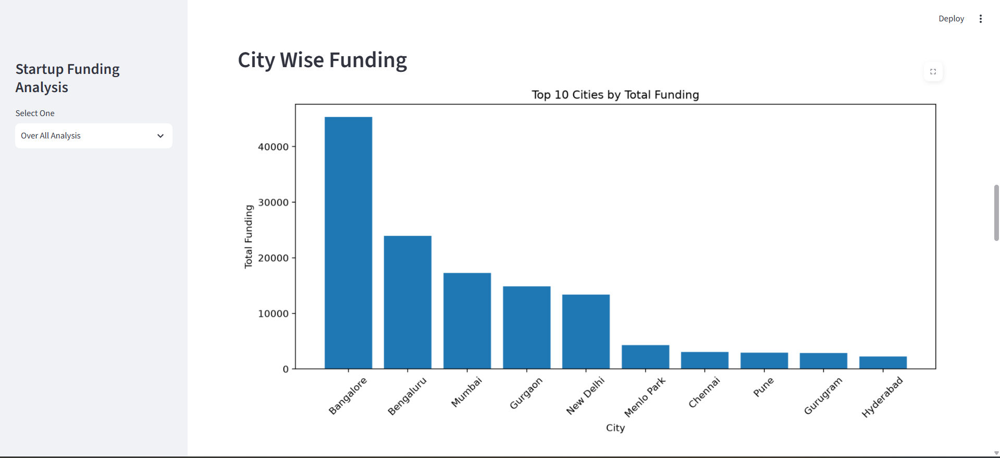
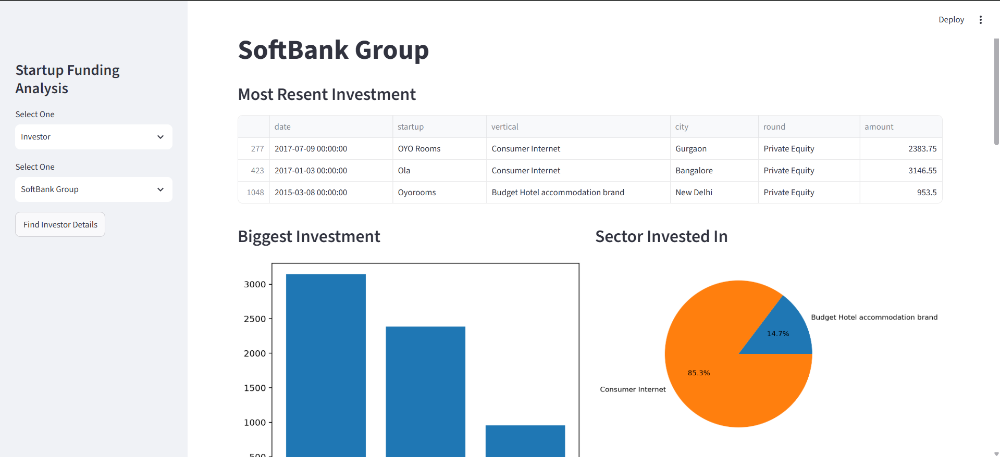
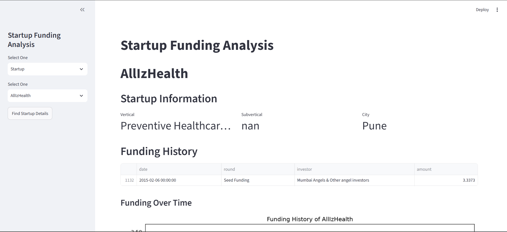

# 🚀 Indian Startup Funding Analysis Dashboard

> An interactive data analytics dashboard built with Python and Streamlit to analyze Indian startup funding trends, investor behavior, sector performance, geographic patterns, and startup-level insights.

[](https://www.python.org/)
[](https://pandas.pydata.org/)
[](https://matplotlib.org/)
[](https://streamlit.io/)

---

## 📌 Project Overview

The **Indian Startup Funding Analysis Dashboard** is an interactive data analytics project developed to explore and understand funding patterns across the Indian startup ecosystem.

The project analyzes startup funding data from multiple perspectives, including:

- Overall funding trends
- Sector-wise funding performance
- Funding types and stages
- City-wise funding distribution
- Top-funded startups
- Top investors
- Investor investment patterns
- Startup-level funding history
- Year-over-year investment trends

The project follows an end-to-end **Data Analytics workflow**, from raw data cleaning and transformation to exploratory analysis, visualization, and interactive dashboard development.

---

## 🎯 Project Objectives

The main objectives of this project are to:

- Analyze overall Indian startup funding trends
- Identify sectors receiving the highest funding
- Understand funding distribution across different cities
- Analyze funding stages and funding types
- Identify top-funded startups
- Identify major investors
- Analyze investor behavior across sectors, stages, and locations
- Explore startup-level funding history
- Build an interactive dashboard for data-driven analysis

---

## 📊 Dashboard Views

The dashboard is organized into three major analytical sections.

### 📊 Overall Analysis

Provides a high-level overview of the Indian startup funding ecosystem.

**Key metrics and analysis:**

- Total Funding
- Maximum Funding
- Average Funding
- Total Funded Startups
- Month-on-Month Funding Trends
- Sector-wise Funding
- Funding Type Analysis
- City-wise Funding
- Top Startups
- Top Investors
- Funding Heatmap

### 💰 Investor Analysis

Provides an investor-focused view of startup investment activity.

**Key analysis includes:**

- Recent Investments
- Biggest Investments
- Sector-wise Investment Distribution
- Funding Stage Distribution
- City-wise Investment Distribution
- Year-over-Year Investment Analysis

### 🏢 Startup Analysis

Provides detailed startup-level insights.

**Key analysis includes:**

- Startup Information
- Industry / Vertical
- Sub-industry / Subvertical
- City
- Funding Information
- Funding History
- Funding Trends
- Startup-level Funding Analysis

---

## 📸 Dashboard Preview

### 📊 Overall Analysis



---

### 📈 Sector Analysis



---

### 🏙️ City Wise Funding



---

### 💰 Investor Analysis



---

### 🚀 Startup Analysis



---

## 🔍 Data Analytics Workflow

The project follows a practical end-to-end data analytics workflow:

```text
Raw Dataset
     ↓
Data Cleaning
     ↓
Data Transformation
     ↓
Exploratory Data Analysis
     ↓
Data Aggregation
     ↓
Trend & Category Analysis
     ↓
Data Visualization
     ↓
Interactive Dashboard

👨‍💻 Author

Raushan Abhishek
Computer Science & Engineering | Data Science

🎯 Aspiring Data Analyst

Python • SQL • Excel • Pandas • NumPy • Matplotlib • Seaborn

⭐ If you found this project useful, consider giving it a star!
